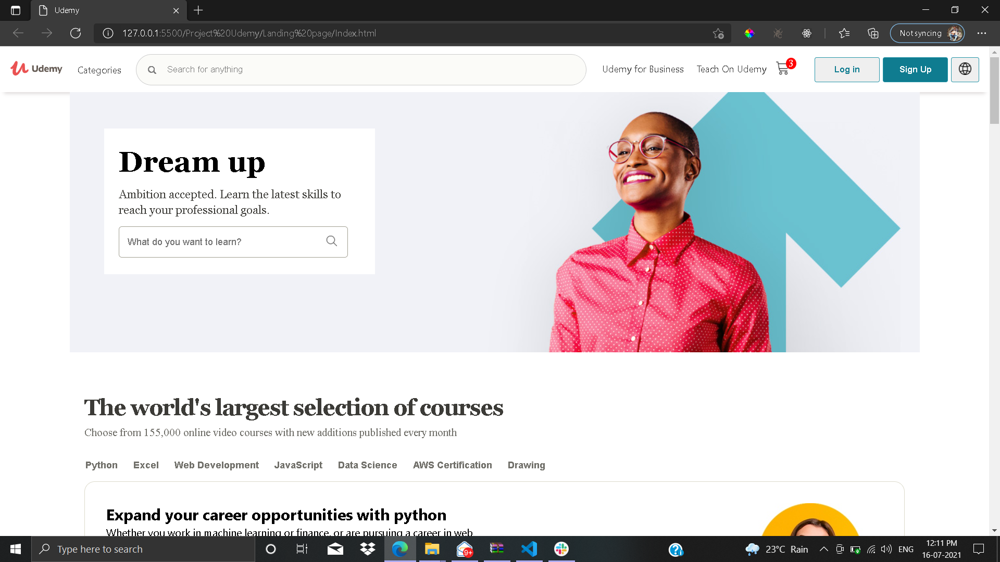
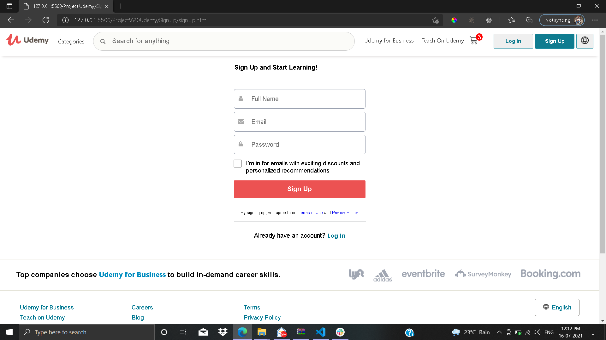
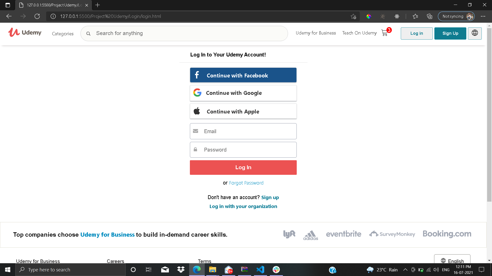
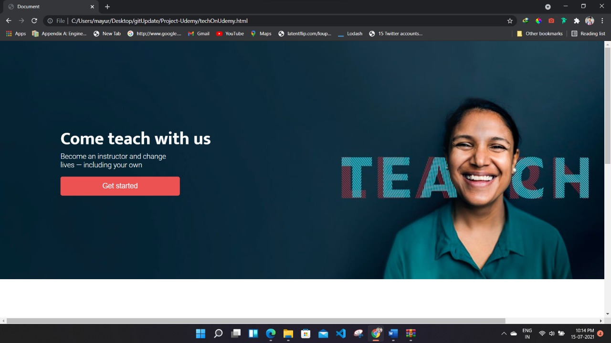
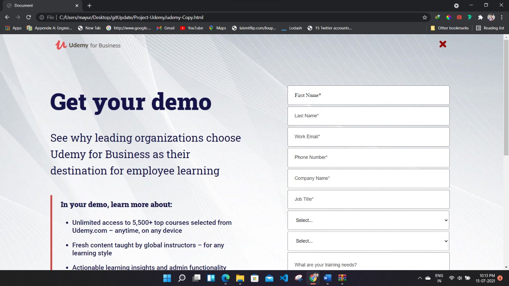
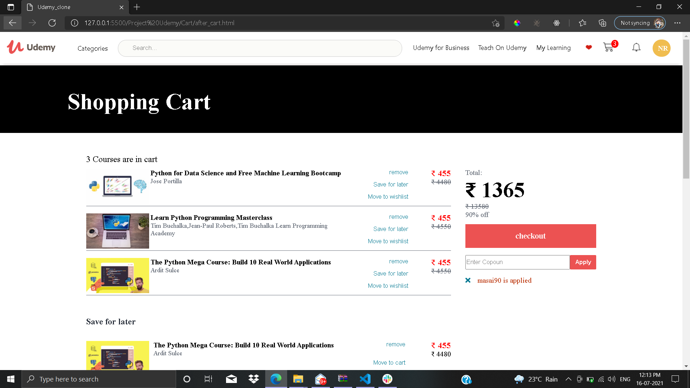
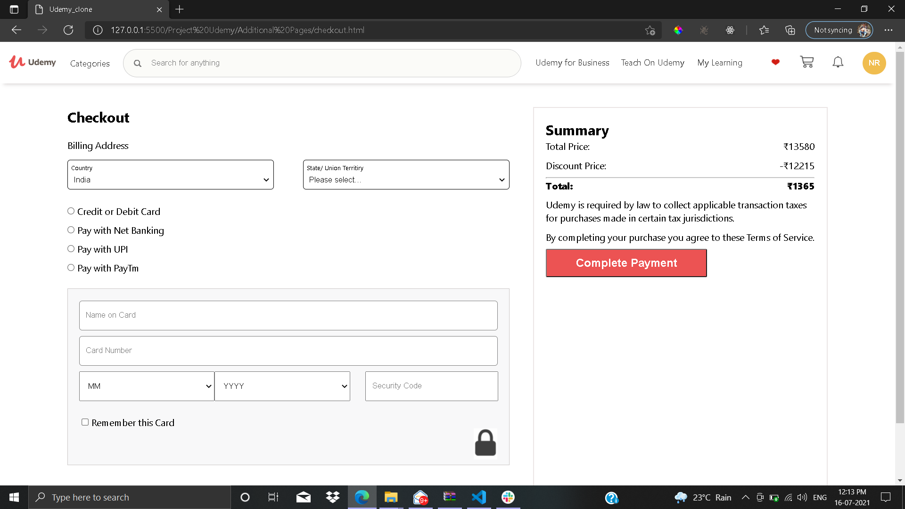

# Project Udemy

Our team was given a task to Clone the Udemy Website.
Tech stacks used :
To create this clone following Tech stack is used by contributors.

- _HTML_
- _CSS_
- _JAVA SCRIPT_

### Landing Page :

The Landing Page of Udemy website displays various Courses and offers.
In top section there is a Header which displays Dropdown menu of pages.
Sliders are included in the page, popups are shown when hovered.
At the bottom section there is a footer, both Header & Footer are same across all the pages.
The page is responsive for all screen sizes.

The library used for icon is:"https://use.fontawesome.com/"

### Login Page & SignUp page:

Existing user can Login and new user's can SignUp themselves on page.
to SignUp and Login there are Two option,
From NavigationBar of Landing Page.

From Dedicated Login Page Login

After Login the initial letter of user will be visible at right-most corner. User can Log out after hovering on the name.
User direcly redirect to home page.

There are many Child pages linked to the Landing page and after login page, but for this clone following pages are made.
**Udemy for Business**
**Teach On Udemy**

### Products Pages :

There are some Key Features which are added in website clone such as,

- Cart Containing wishlist, save for later and Coupon Application feature.
- Checkout Page with subscription Status.
- Payment Mode Message.
  
  

## Team Members and Contributors

- [@Omkar Gavade](https://github.com/omkarvgavade)
- [@Sudhir kumar samantaray](https://github.com/devSudhir)
- [@Mayur Kamthe](https://github.com/mayur8600)
